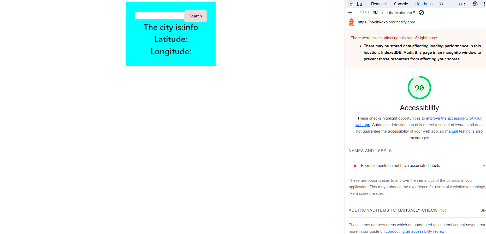

# Project Name

**Author**: Niles Thompson
**Version**: 1.9.0 (increment the patch/fix version number if you make more commits past your first submission)

## Overview

City Explorer is a location-based service that utilizes the LocationIQ API to retrieve and display information about a given location. The application allows users to input a search query (likely a city or place name), performs an API call to LocationIQ, and then displays relevant information such as the city name, latitude, and longitude. Additionally, the application generates a static map for the specified location.

## Getting Started

In order to run the city explorer  application on your machine, follow these steps: Clone the repository, install dependencies using npm, obtain a LocationIQ API key, replace YOUR_ACCESS_TOKEN in the code with your API key, and start the development server. Once the server is running, open the application in a web browser, input a city or place name, and click "Search" to retrieve and display location information, including city name, latitude, and longitude. 

## Architecture
React:

The frontend is built using the React library, allowing for the creation of a dynamic and interactive user interface.
Axios:

Axios is used for making HTTP requests to the LocationIQ API. It simplifies the process of handling asynchronous requests and responses.
Bootstrap:

Bootstrap is employed for styling and responsiveness. The Bootstrap Alert component is used to display error messages in case of API call failures.
LocationIQ API:

The application relies on the LocationIQ API to retrieve geographical information based on user input.

## Change Log

Initial Setup and API Integration
Created a new React application.
Integrated Axios for making API requests to LocationIQ.
Set up basic components and state management.
Tested API integration with a hardcoded location.

Dynamic User Input and Search
Implemented a dynamic input field for users to enter search queries.
Created a function (onSearchChange) to update the search query state on input changes.
Linked the input field to the state to reflect user input.

Location Search and Display
Implemented the getLocation function to fetch location data based on the user's search query.
Displayed city name, latitude, and longitude from the API response.

Static Map Generation
Created the generateStaticMapURL function to generate a static map URL using latitude and longitude.
Displayed the static map below the location information when available.

Incorporated Bootstrap for styling to achieve a clean and responsive design.
Styled input fields, buttons, and error messages using Bootstrap classes.
## Credit and Collaborations

Contributors: chat GPT for alert functionality.

# Data Flow:
Input: Search Query

Component State: searchQuery in useState.
User Interaction: Input from the user through the text input field.
Function: onSearchChange

Input: Event object from the text input field.
Output: Updates the searchQuery state.
Function: searchLocation

Input: Button click event.
Output: Calls the getLocation function.
Function: getLocation

Input: None explicitly, but relies on the searchQuery.
Output:
Sends an API request to LocationIQ using the searchQuery.
If successful, updates the location state with the response data.
If an error occurs, sets an error message in the error state.
Output: Location Information

Component State: location in useState.
Display: City name (location.display_name), latitude (location.lat), and longitude (location.lon).
Function: generateStaticMapURL

Input: Latitude (location.lat) and Longitude (location.lon) from the location state.
Output: Constructs a static map URL using the provided latitude and longitude.
Output: Static Map

Display: If there's no error and latitude and longitude are available, displays a static map using the URL generated by generateStaticMapURL.
Output: Error Message (if applicable)

Component State: error in useState.
Display: If an error occurs during the API call, displays an error message using the Bootstrap Alert component.

Name of feature: latitude and longitude
Estimate of time needed to complete: 20 minutes

Start time:     130

Finish time: 140

Actual time needed to complete: 10 minutes

This template provides a minimal setup to get React working in Vite with HMR and some ESLint rules.

Currently, two official plugins are available:

- [@vitejs/plugin-react](https://github.com/vitejs/vite-plugin-react/blob/main/packages/plugin-react/README.md) uses [Babel](https://babeljs.io/) for Fast Refresh
- [@vitejs/plugin-react-swc](https://github.com/vitejs/vite-plugin-react-swc) uses [SWC](https://swc.rs/) for Fast Refresh
